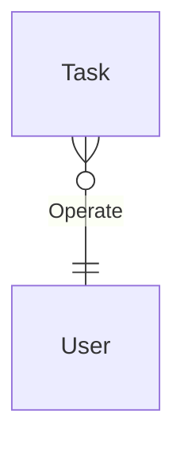
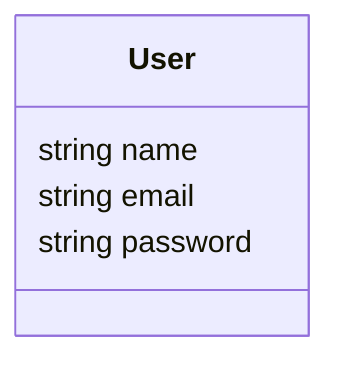

# Todo-app-plan

## Metadata

|Metadata |             |
|---      |---          |
| Author  | AnjeZenda   |
| Created | 07.11.2025  |
| Changed | 07.11.2025  |
| Tags    | arc, plan   |

## Backend

### First stage

Реализация простого сервиса с CRUD-операциями по упралению задачами:

- `POST /tasks` создание задач
- `GET /tasks` получение задач (при подгрузке информации)
- `UPDATE /tasks/{task_id}` обновление состояния задачи, либо изменение задачи в случае ошибок
- `DELETE /tasks/{task_id}` удаление задачи

Реализовать сервис статистики который будет отображать текущую статистику по задачам

- `POST /statistics`, с передачей фильтров в body

Реализовать сервис аунтификации и авторизацииЖ

- `POST /register` - создание учетной записи
- `POST /login` - вход в аккаунт

### Second stage

## Mobile x Frontend

## ML

## Infra

